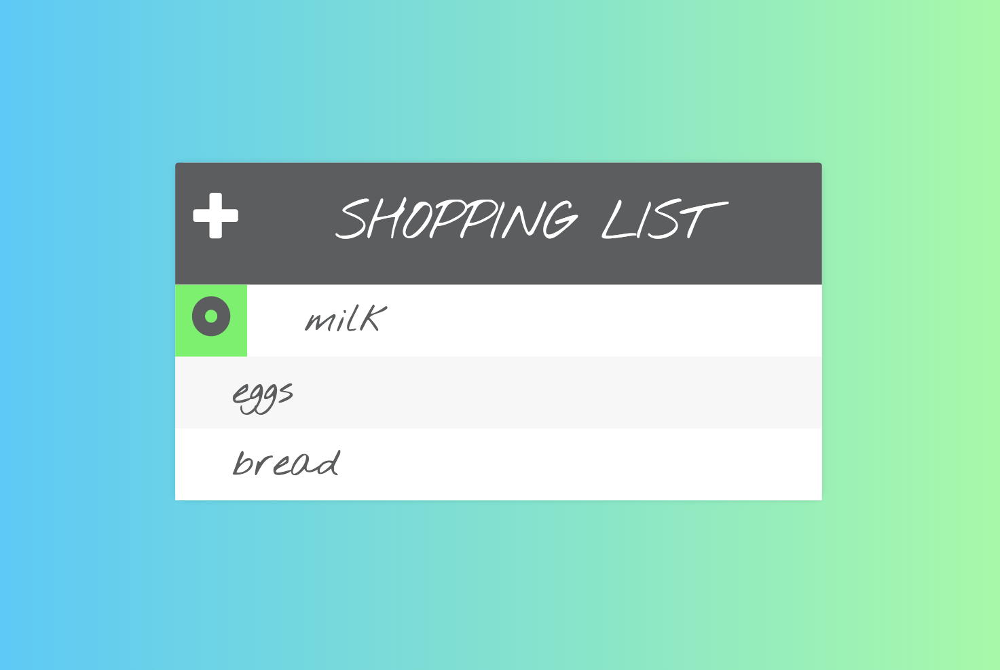

# JavaScript Projects

A collection of projects using javaScript, including jQuery, Nodejs.

## 1.  Simple Shopping List
Shopping list with line-through and delete items functions and add item input, which is hideable.

## 2.  SoundsTyping
### Animation and sound project.  
Typing on the keyboard releases sounds which coincide with colorful circle animation.  Javascript libraries: howler.js and Paper.js.

 
## 3.  RGB Game
Basic javascript project with random number generator for red, green blue (rgb) color values.
CSS and Javascript styling.

